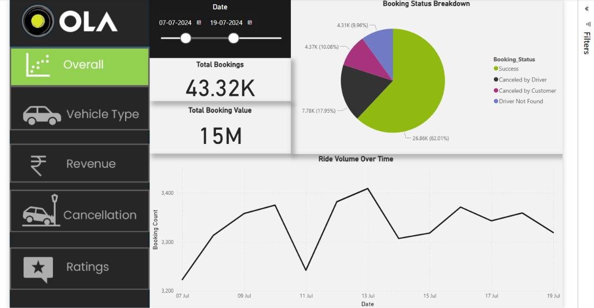
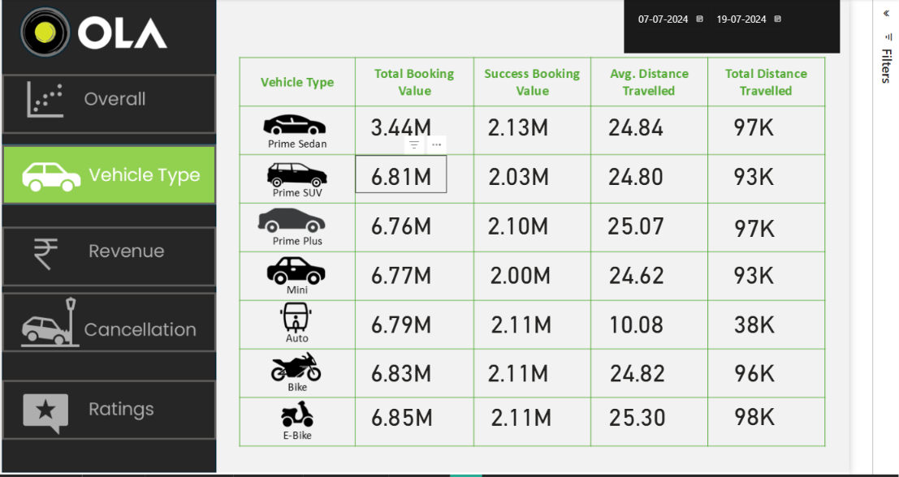
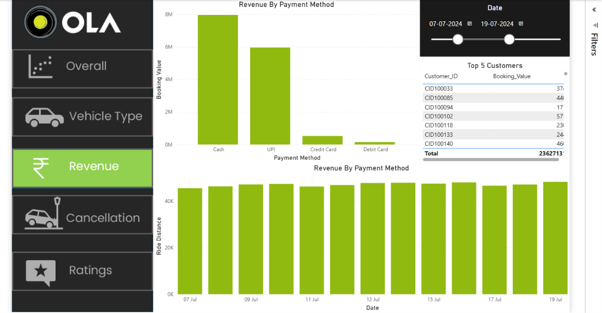
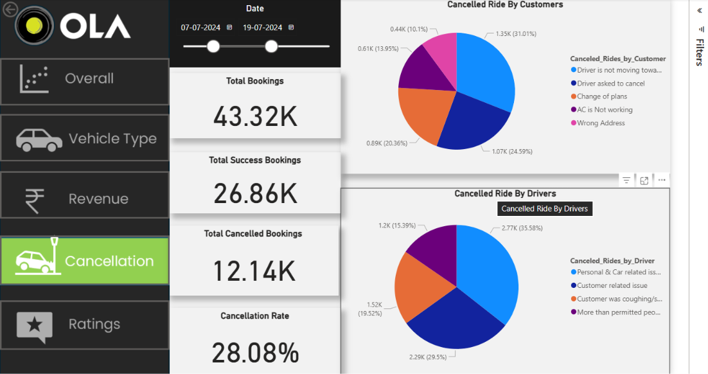
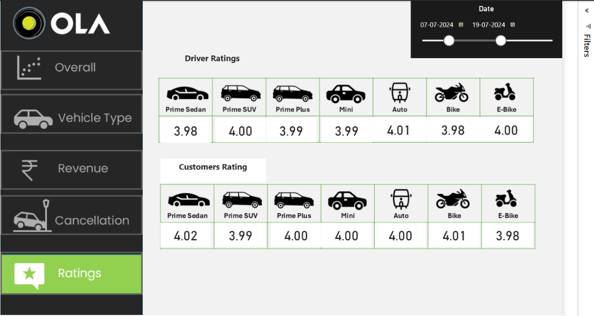

# 🚖 Ola Ride Analytics Dashboard

## 📌 Project Overview

This project presents an **interactive Power BI dashboard** built using **SQL, Python, and Power BI** to analyze Ola ride booking data. The dashboard provides insights into booking trends, revenue, cancellations, vehicle performance, customer behavior, and ratings to support data-driven business decisions.

---

## 🌐 Live Dashboard

🔗 **Power BI Dashboard**

**<https://app.powerbi.com/reportEmbed?reportId=44ddb161-ae7a-4b71-be18-906c4f81d83d&autoAuth=true&ctid=3ad87f0e-1f93-41bd-94f4-82c37d971c88>**


---

## 🎯 Objectives

- Analyze overall booking performance
- Monitor booking success and cancellation rates
- Compare vehicle-wise performance
- Analyze revenue trends
- Understand customer and driver cancellation reasons
- Evaluate customer and driver ratings
- Support business decision-making through interactive dashboards

---

# 🛠️ Tech Stack

- **Power BI**
- **SQL**
- **Python**
- **Pandas**
- **NumPy**
- **Jupyter Notebook**
- **DAX**
- **Power Query**

---

# 📂 Repository Structure

```
Ola-Ride-Analytics-Dashboard
│
├── Dashboard
│   └── Ola_Ride_Analytics_Dashboard.pbix
│
├── Dataset
│   └── Booking.csv
│
├── Images
│   ├── Overall.png
│   ├── Vehicle_type.png
│   ├── Revenue.png
│   ├── Cancellation.png
│   └── Rating.png
│
├── Python
│   └── EDA.ipynb
│
├── SQL
│   └── ola.sql
│
└── README.md
```

---

# 📊 Dashboard Pages

## 📈 Overall Dashboard

Provides an overview of:

- Total Bookings
- Total Booking Value
- Booking Status Distribution
- Ride Volume Trend
- Interactive Date Filter

---

## 🚗 Vehicle Type Dashboard

Vehicle-wise analysis including:

- Total Booking Value
- Successful Booking Value
- Average Distance Travelled
- Total Distance Travelled

Vehicle Categories:

- Prime Sedan
- Prime SUV
- Prime Plus
- Mini
- Auto
- Bike
- E-Bike

---

## 💰 Revenue Dashboard

Revenue insights by:

- Payment Method
- Daily Revenue Trend
- Top Customers
- Booking Value Analysis

Payment Methods:

- Cash
- UPI
- Credit Card
- Debit Card

---

## ❌ Cancellation Dashboard

Analyzes cancellations by both customers and drivers.

### Customer Cancellation Reasons

- Driver not moving
- Driver asked to cancel
- Change of plans
- AC not working
- Wrong address

### Driver Cancellation Reasons

- Personal & vehicle issues
- Customer-related issues
- Customer unavailable
- Exceeded passenger limit

KPIs:

- Total Bookings
- Successful Bookings
- Cancelled Bookings
- Cancellation Rate

---

## ⭐ Ratings Dashboard

Compares ratings across all vehicle categories.

Includes:

- Driver Ratings
- Customer Ratings

---

# 📊 Key Performance Indicators (KPIs)

- Total Bookings
- Successful Bookings
- Cancelled Bookings
- Booking Value
- Revenue
- Cancellation Rate
- Ride Distance
- Average Distance Travelled
- Customer Ratings
- Driver Ratings

---

# 💡 Business Insights

- Majority of bookings are completed successfully.
- Cash and UPI are the most preferred payment methods.
- Vehicle categories contribute differently to booking value and distance travelled.
- Cancellation reasons help identify operational bottlenecks.
- Customer and driver ratings remain consistently close to **4.0**, indicating overall service quality.

---

# 📷 Dashboard Preview

## Overall Dashboard



---

## Vehicle Type Dashboard



---

## Revenue Dashboard



---

## Cancellation Dashboard



---

## Ratings Dashboard



---

# 🚀 Skills Demonstrated

- Data Cleaning using SQL
- Exploratory Data Analysis (EDA)
- SQL Query Writing
- Data Visualization
- Power BI Dashboard Design
- DAX Measures
- Power Query
- Business Intelligence
- KPI Development
- Data Storytelling

---

# 📚 Learning Outcomes

Through this project, I gained hands-on experience in:

- SQL-based data extraction and analysis
- Data preprocessing using Python
- Exploratory Data Analysis (EDA)
- Building interactive dashboards using Power BI
- Creating DAX measures and KPIs
- Presenting business insights effectively

---

# 🔮 Future Improvements

- Real-time dashboard integration
- Predictive analytics using Machine Learning
- Revenue forecasting
- Customer segmentation
- Interactive drill-through reports
- Automated dashboard refresh

---

# 👨‍💻 Author

**Kaleem Ali**

🎓 B.Tech Computer Science Engineering

💼 Aspiring Data Analyst | Machine Learning Enthusiast

### GitHub

https://github.com/Kaleemali02

### LinkedIn

https://www.linkedin.com/in/kaleem02/

---

## ⭐ If you found this project helpful, please consider giving it a star!
